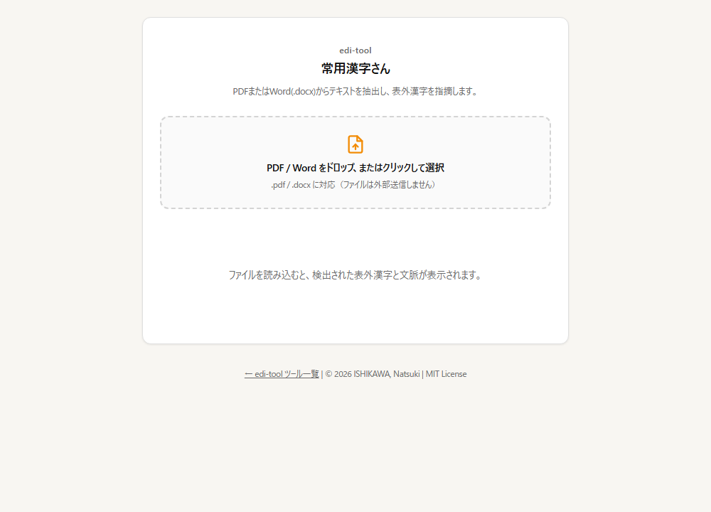

# 表外漢字判定ツール（常用漢字さん）

PDF・Word 内の漢字が常用漢字かを判定し、表外字を前後の文脈つきで指摘するツールです。執筆や編集工程での使用を想定しています。

🔗 https://edi-tool.github.io/kanji-checker/



## 使い方

1. PDF または Word（.docx）ファイルを選ぶ（ドラッグ＆ドロップも可）
2. 常用漢字表にない漢字が、出現回数・前後の文脈とともに一覧表示されます。人名用漢字には印が付きます
3. 常用漢字なのに誤って検出された文字は「誤検知を報告」から知らせることができます（後述）

## データの扱い

- 読み込んだファイルは **ブラウザ内で解析し、サーバーへアップロードしません**。
- 外部から読み込むライブラリ（cdn.jsdelivr.net）
  - [PDF.js](https://mozilla.github.io/pdf.js/)（pdfjs-dist 6.1.200）… PDF からのテキスト抽出
  - [Mammoth.js](https://github.com/mwilliamson/mammoth.js) 1.12.0 … .docx からのテキスト抽出
- **例外：誤検知の報告**。利用者が「誤検知を報告」ボタンを押し、確認ダイアログで OK したときだけ、**その漢字 1 字と、最初の 3 か所ぶんの文脈（各前後 15 文字）** を Google Apps Script（script.google.com）へ送信し、管理用スプレッドシートに記録します。原稿に機密情報や個人情報が含まれる場合は報告ボタンを使わないでください。

## 判定基準とデータ出典

### 1. 判定基準（常用漢字）

判定に使用している漢字リストは、**文化庁「常用漢字表（平成22年内閣告示第2号）」** に基づいた計 2,136 文字です（`kanji_data.js`）。

> [文化庁 常用漢字表について](https://www.bunka.go.jp/kokugo_nihongo/sisaku/joho/joho/kijun/naikaku/kanji/index.html)

表外字のうち人名用漢字に当たるものは、`jinmei-kanji-data.js` で判別して印を付けます。

### 2. テキストの正規化

解析前に Unicode 正規化（NFKC）を行っています。これにより、互換漢字や全角記号などの表記ゆれによる誤判定を抑制しています。

### 3. 文脈表示仕様

常用外漢字を検出した際、その前後の各 15 文字を「文脈」として表示します。これにより、固有名詞（人名・地名）や専門用語としての許容範囲かどうかを即座に判断可能です。

## 制限事項

- PDF の作成方法（画像化された PDF など）によっては、テキストが抽出できない場合があります。その場合は「テキストを取り出せませんでした」と表示し、判定は行いません。
- PDF のフォント内部の文字マッピングにより、見た目は常用漢字でも別の文字コード（康熙部首・異体字など）として抽出され、表外字として誤検知されることがあります（対応は下記「メンテナンスフロー」）。
- 本ツールは校正の補助を目的としており、最終的な表記確認は利用者の責任において行ってください。

## メンテナンスフロー：常用漢字が誤検知される場合の対応

誤検知された文字は、`kanji_data.js` 内に定義されている `houseRules` に登録します。

0. **誤検出出力先スプレッドシート**

   https://docs.google.com/spreadsheets/d/1gdi5GnxSJl3iEojIpPhFdby6_uUS5dQ_iUdmIfXp87k/edit?usp=sharing

1. **誤検知された文字をコピーする**

   **【⚠️重要】** キーボードで普通に入力すると標準の文字コードに変換されてしまうため、**必ずツールの結果画面（表外漢字として表示されている箇所）から、エラーになった文字を直接ドラッグ＆コピー**してください。

2. **`kanji_data.js` を編集する**

   ファイルの末尾にある `houseRules` に、手順 1 でコピーした文字を貼り付けます。複数の文字を追加する場合は、そのまま文字列としてつなげて記述します。

   ```javascript
   // kanji_data.js の末尾
   // 必要に応じて、追加で許容する「ハウスルール漢字」を定義することも可能です
   const houseRules = "長民"; // ←※必ずツールの画面からコピペして追加してください
   ```

3. **テストを実行する**（`npm test`。ハウスルールの文字が検出されないことを確認します）

この運用により、PDF 特有の文字コードのズレを吸収し、誤検知を防ぐことができます。

## 開発

ビルド工程はありません。`index.html` をそのまま GitHub Pages が配信します。

```bash
python -m http.server 8000   # プレビュー
npm test                     # テスト（Node.js 22 以上、依存パッケージなし）
npm run check                # HTML の静的チェック
```

- テストは `index.html` を変更せずに判定関数を取り出して実行します（`tests/`）。常用漢字 2,136 字の件数、文脈 15 文字、外部送信が報告ボタンの 1 か所だけであることなどを確認しています。
- 変更履歴は [CHANGELOG.md](CHANGELOG.md) を参照してください。
- 開発方針は [edi-tool 開発原則](https://github.com/edi-tool/.github/blob/main/PRINCIPLES.md) に従います。

## 参考文献 / References

本プロジェクトの開発にあたり、以下の資料およびデータを参照・利用させていただきました。

### 公的資料

- [常用漢字表（索引）](https://www.bunka.go.jp/seisaku/kokugo_nihongo/kokugo_shisaku/joyokanjihyo_sakuin/index.html) - 文化庁
  - 常用漢字の字体・読みの公式基準として参照

### データ・リポジトリ

- [mimneko/kanji-data](https://github.com/mimneko/kanji-data)
  - 漢字データの構造化におけるベースデータとして利用
- [vaiorabbit/everyday_use_kanji](https://github.com/vaiorabbit/everyday_use_kanji)
  - 人名用漢字リストの出典（`jinmei-kanji-data.js`）

### システム

- [Mammoth.js](https://github.com/mwilliamson/mammoth.js)
  - 本ツールのシステムの参考

### デザイン

- [kzhrknt/awesome-design-md-jp](https://github.com/kzhrknt/awesome-design-md-jp)
  - 本ツール（index）のデザインの参考

## 関連ツール

- [漢字学習学年判定ツール（教育漢字さん）](https://edi-tool.github.io/edu-kanji-checker/) — 小学校で習う学年ごとに漢字を分類
- [表記統一さん](https://edi-tool.github.io/hyoki-checker/) — 表記ゆれの検出
- [edi-tool のツール一覧](https://edi-tool.github.io/)

## ライセンス

MIT License © 2026 ISHIKAWA, Natsuki（[LICENSE](LICENSE)）

実行時に読み込む PDF.js（Apache-2.0）・Mammoth.js（BSD-2-Clause）は、それぞれのライセンスに従います。
